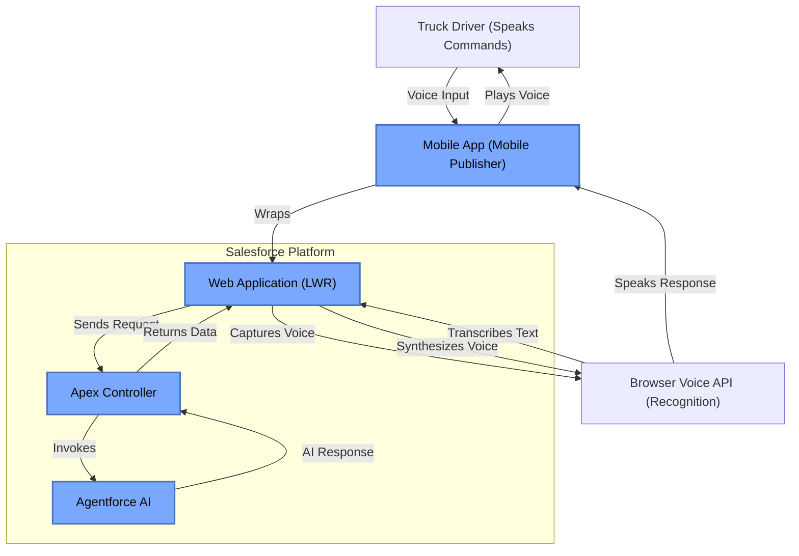
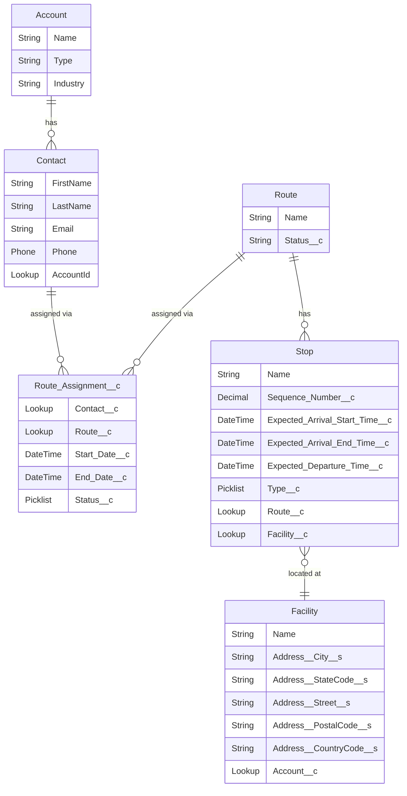

# Voice Assistant on Agentforce

##Manual Configuration

1. Setup->User Interface->Enable Address Field->Save

## Flowchart

```mermaid

flowchart TD
    TruckDriver["Truck Driver (Speaks Commands)"] -->|Voice Input| MobileApp["Mobile App (Mobile Publisher)"]
    MobileApp -->|Wraps| WebApp["Web Application (LWR)"]
    WebApp -->|Captures Voice| VoiceAPI["Browser Voice API (Recognition)"]
    VoiceAPI -->|Transcribes Text| WebApp
    WebApp -->|Sends Request| ApexController["Apex Controller"]
    ApexController -->|Invokes| Agentforce["Agentforce AI"]
    Agentforce -->|AI Response| ApexController
    ApexController -->|Returns Data| WebApp
    WebApp -->|Synthesizes Voice| VoiceAPI
    VoiceAPI -->|Speaks Response| MobileApp
    MobileApp -->|Plays Voice| TruckDriver

    subgraph Salesforce Platform
      WebApp
      ApexController
      Agentforce
    end

    classDef mobilePublisher fill:#7BA8FF,color:#060606,stroke:#4A71BD,stroke-width:2px;
    classDef lwr fill:#7BA8FF,color:#060606,stroke:#4A71BD,stroke-width:2px;
    classDef apex fill:#7BA8FF,color:#060606,stroke:#4A71BD,stroke-width:2px;
    classDef agentforce fill:#7BA8FF,color:#060606,stroke:#4A71BD,stroke-width:2px;

    class MobileApp mobilePublisher;
    class WebApp lwr;
    class ApexController apex;
    class Agentforce agentforce;

```

## Data Model

```mermaid
erDiagram
    Account ||--o{ Contact : "has"
    Contact ||--o{ Route_Assignment__c : "assigned via"
    Route ||--o{ Route_Assignment__c : "assigned via"
    Route ||--o{ Stop : "has"
    Stop }o--|| Facility : "located at"
    

    Account {
        String Name
        String Type
        String Industry
    }

    Contact {
        String FirstName
        String LastName
        String Email
        Phone Phone
        Lookup AccountId
    }

    Route_Assignment__c {
        Lookup Contact__c
        Lookup Route__c
        DateTime Start_Date__c
        DateTime End_Date__c
        Picklist Status__c
    }

    Route {
        String Name
        String Status__c
    }

    Stop {
        String Name
        Decimal Sequence_Number__c
        DateTime Expected_Arrival_Start_Time__c
        DateTime Expected_Arrival_End_Time__c
        DateTime Expected_Departure_Time__c
        Picklist Type__c
        Lookup Route__c
        Lookup Facility__c
    }

    Facility {
        String Name
        String Address__City__s
        String Address__StateCode__s
        String Address__Street__s
        String Address__PostalCode__s
        String Address__CountryCode__s
        Lookup Account__c
    }
```