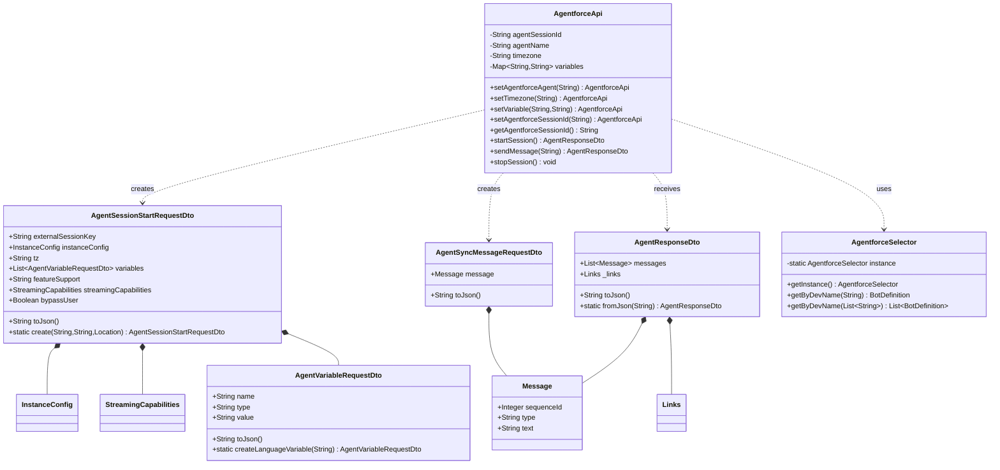

# Agent API Framework

## Configuration

1. First deploy or create `Agent_Experience` connected app
1. Add `Agent_Experience` connected app to the Agentforce Agent you want to use via API
1. When `Agent_Experience` configuration is finished take Client Id and Client Secred from the Connected App management page
1. Use clien id and client secret taken from `Agent_Experience` connected app and save in Named Principal `Experience User` on External Credentials
1. Update `AagentApiCreds` external credentials with the domain of your salesforce org

## Usage Examples

### Starting a New Session

```apex
// Initialize API and start a session
AgentforceApi agentApi = new AgentforceApi();
AgentResponseDto resp = agentApi
    .setAgentforceAgent('Driver_Support')     // Set agent name
    .setTimezone('Europe/Minsk')              // Set timezone
    .setVariable('$Context.Contact', '003GA00004C7RxdYAF')  // Add contact context
    .setVariable('$Context.Latitude', '33.333')             // Add location
    .setVariable('$Context.Longitude', '44.444')
    .startSession();

// Store session ID for subsequent requests
String sessionId = agentApi.getAgentforceSessionId();
```

### Sending Messages

```apex
// Send a message using existing session
AgentforceApi agentApiMessage = new AgentforceApi();
AgentResponseDto resp = agentApiMessage
    .setAgentforceSessionId(sessionId)        // Use existing session
    .setVariable('$Context.Contact', '003GA00004C7RxdYAF')  // Set context
    .setVariable('$Context.Latitude', '33.333')
    .setVariable('$Context.Longitude', '44.444')
    .sendMessage('Please tell me about my upcoming routes');
```

### Ending a Session

```apex
// Properly close the session
AgentforceApi agentApiStopSession = new AgentforceApi();
agentApiStopSession
    .setAgentforceAgent('Driver_Support')
    .setAgentforceSessionId(sessionId)
    .stopSession();
```

### Best Practices

1. **Session Management**
   - Always store the session ID after starting a new session
   - Reuse the session ID for subsequent messages
   - Remember to stop the session when finished

2. **Context Variables**
   - Set relevant context variables before each operation
   - Include user location when available
   - Always include contact ID for user context

3. **Error Handling**
   - Implement try-catch blocks around API calls
   - Store session IDs securely
   - Validate responses before processing

### Common Variables

- `$Context.Contact`: Salesforce Contact ID
- `$Context.Latitude`: User's latitude
- `$Context.Longitude`: User's longitude
- `$Context.EndUserLanguage`: User's language preference

## Framework Architecture

## Framework Architecture



This diagram shows:
- Main API class and its relationships
- DTOs for request/response handling
- Selector for data access
- Token exchange for authentication
- Helper classes and their methods